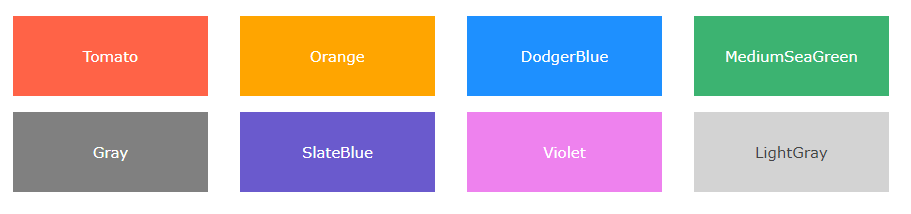
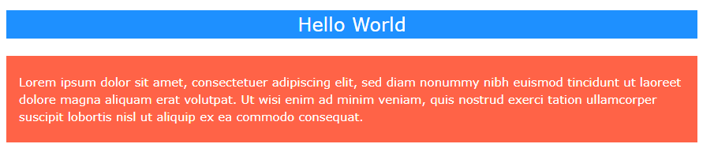
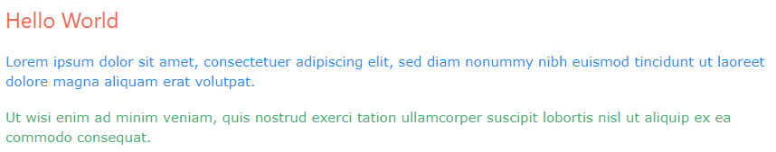
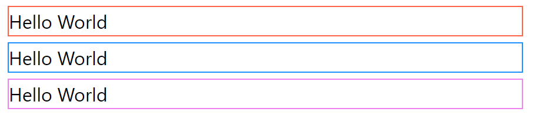
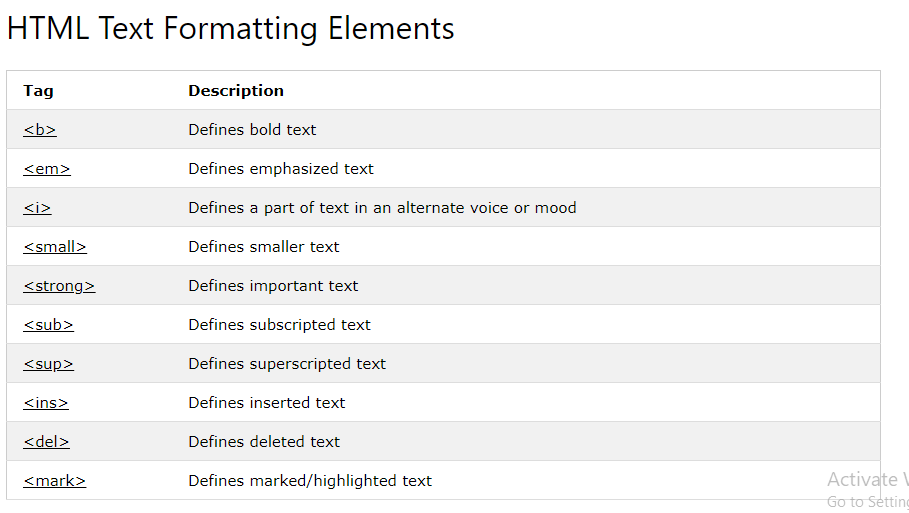

# **Images, Color, Text**

# **Images :**

**Images can improve the design and the appearance of a web page.**

## **HTML Images Syntax :**

### The HTML  tag is used to embed an image in a web page.

### Images are not technically inserted into a web page; images are linked to web pages. The  tag creates a holding space for the referenced image.

## **The < img> tag is empty, it contains attributes only, and does not have a closing tag.**

## **The  tag has two required attributes:**

* ## src - Specifies the path to the image
* ## alt - Specifies an alternate text for the image

## **Syntax:**

## < img src="url" alt="alternatetext">

## **1. The src Attribute :**

## The required src attribute specifies the path (URL) to the image.

## Note: When a web page loads; it is the browser, at that moment, that gets the image from a web server and inserts it into the page. Therefore, make sure that the image actually stays in the same spot in relation to the web page, otherwise your visitors will get a broken link icon. The broken link icon and the alt text are shown if the browser cannot find the image.

## **2. The alt Attribute :**

## The required alt attribute provides an alternate text for an image, if the user for some reason cannot view it (because of slow connection, an error in the src attribute, or if the user uses a screen reader).

## The value of the alt attribute should describe the image .

## If a browser cannot find an image, it will display the value of the alt attribute.

## **Image Size - Width and Height**

## You can use the style attribute to specify the width and height of an image.

***Example :***

**< img src="img_girl.jpg" alt="Girl in a jacket" style="width:500px;height:600px;">**

## Alternatively, you can use the width and height attributes:

**< img src="img_girl.jpg" alt="Girl in a jacket" width="500" height="600">**

## The width and height attributes always define the width and height of the image in pixels.

## **Animated Images**

## HTML allows animated GIFs:

## **Image as a Link**

## To use an image as a link, put the  tag inside the < a> tag:

## **Image Floating**

## Use the CSS float property to let the image float to the right or to the left of a text

## **Three Rules for Creating Images**

1. Save images in the right format :

 Websites mainly use images in jpeg, gif, or png format. If you choose the wrong image format then your image might not look as sharp as it should and can make the web page slower to load

2. Save images at the right size : 

You should save the image at the same width and height it will appear on the website. If the image is smaller than the 
width or height that you have specified, the image can be distorted and stretched. If the image is larger than the width and height if you have specified, the image will take longer to display on the page .

3. Use the correctresolution :

Computer screens are made up of dots known as pixels. Images used on the web are also made up of tiny dots. Resolution refers to the number of dots per inch, and most computer screens only show web pages at 72 pixels per inch. So saving images at a higher resolution results in images that are larger than necessary and take longer to download

# **Color :**

**HTML colors are specified with predefined color names, or with RGB, HEX, HSL, RGBA, or HSLA values.**

## **Color Names**

## In HTML, a color can be specified by using a color name:

## **Background Color**

##You can set the background color for HTML elements:

**< h1 style="background-color:DodgerBlue;">Hello World< /h1>**
**< p style="background-color:Tomato;">Lorem ipsum...< /p>**

## **Text Color**

## You can set the color of text:

< h1 style="color:Tomato;">Hello World< /h1>
< p style="color:DodgerBlue;">Lorem ipsum...< /p>
< p style="color:MediumSeaGreen;">Ut wisi enim...< /p>

## **Border Color**

## You can set the color of borders:

**< h1 style="border:2px solid Tomato;">Hello World< /h1>**
**< h1 style="border:2px solid DodgerBlue;">Hello World< /h1>**
**< h1 style="border:2px solid Violet;">Hello World< /h1>**

## **Color Values**

## In HTML, colors can also be specified using RGB values, HEX values, HSL values, RGBA values, and HSLA values.

# **Text :** 

* There are properties to control the choice of font, size, weight, style, and spacing.
* There is a limited choice of fonts that you can assume most people will have installed.
* If you want to use a wider range of typefaces there are several options, but you need to have the right license 
to use them.
* You can control the space between lines of text, individual letters, and words. Text can also be aligned 
to the left, right, center, or justified. It can also be indented.
* You can use pseudo-classes to change the style of an element when a user hovers over or clicks on text, or 
when they have visited a link.

## **JPEG vs PNG vs GIF — which image format to use and when?**:

##  When should I use PNG or JPEG?

**PNG format is a lossless compression file format, which makes it a common choice for use on the Web. PNG is a good choice for storing line drawings, text, and iconic graphics at a small file size. JPG format is a lossy compressed file format. This makes it useful for storing photographs at a smaller size than a BMP**

## When should I use a GIF format?

**Use GIF when your graphic uses a relatively low number of colors, there are hard-edged shapes, large areas of solid color, or needs to make use of binary transparency. These exact same rules apply for 8-Bit PNG's. You can think of them almost exactly like GIF files**

### You can know more about this by visiting thiis link  : 

[JPEG vs PNG vs GIF](https://blog.imagekit.io/jpeg-vs-png-vs-gif-which-image-format-to-use-and-when-c8913ae3e01d)

