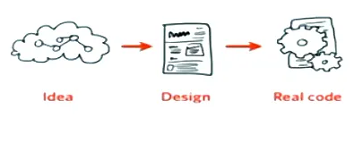

# Introductory HTML and JavaScript
# HTML& CSS
# Structure

* HTML pages are text documents.
* HTML uses tags (characters that sit inside angled
brackets) to give the information they surround special
meaning.
* Tags are often referred to as elements.
* Tags usually come in pairs. The opening tag denotes
the start of a piece of content; the closing tag denotes
the end.
* Opening tags can carry attributes, which tell us more
about the content of that element.
* Attributes require a name and a value.
* To learn HTML you need to know what tags are
available for you to use, what they do, and where they
can go.

# Extra Markup

* DOCTYPES tell browsers which version of HTML you
are using.
* You can add comments to your code between the
<!-- and --> markers.
* The id and class attributes allow you to identify
particular elements.

* The 
 and  elements allow you to group
block-level and inline elements together.
* <iframes> cut windows into your web pages through
which other pages can be displayed.
* The <meta> tag allows you to supply all kinds of
information about your web page.
* Escape characters are used to include special
characters in your pages such as <, >, and ©.

# HTML5 Layou 

* The new HTML5 elements indicate the purpose of
different parts of a web page and help to describe
its structure.
* The new elements provide clearer code (compared
with using multiple 
 elements).
* Older browsers that do not understand HTML5
elements need to be told which elements are
block-level elements.
* To make HTML5 elements work in Internet Explorer 8
(and older versions of IE), extra JavaScript is needed,
which is available free from Google.

# Process & Design

* It's important to understand who your target audience
is, why they would come to your site, what information
they want to find and when they are likely to return.
* Site maps allow you to plan the structure of a site.
* Wireframes allow you to organize the information that
will need to go on each page.
* Design is about communication. Visual hierarchy helps
visitors understand what you are trying to tell them.
* You can differentiate between pieces of information
using size, color, and style.
* You can use grouping and similarity to help simplify
the information you present.

# JavaScript
## HOW javascript makes web bages more interactive :
** 1. ACCESS CONTENT **
You can use JavaScript to select any element, attribute, or text from an HTML page. For example:
* Select the text inside all of the <hl>
elements on a page
* Select any elements that have a c1ass attribute with a value of note
* Find out what was entered into atext input whose id attribute has avalue of emai1

**2. MODIFY CONTENT**
You can use JavaScript to add elements, attributes, and text to the page, or remove them. For example:
* Add a paragraph of text after the first <hl> element
* Change the value of c 1 assattributes to trigger new CSS rules for those elements
* Change the size or position of an <i mg> element 

**3. PROGRAM RULES**
You can specify a set of steps for the browser to follow (like a recipe), which allows it to access or change the
content of a page. For example:
* A gallery script could check which image a user clicked on and display a larger version of that image.
* A mortgage calculator could collect values from a form, perform acalculation, and display repayments.
* An animation could check the dimensions of the browser window and move an image to the bottom of the viewable area (also known as the viewport).

**4. REACT TO EVENTS**
You can specify that a script should run when a specific event has occurred. For example, it could be run when:
* A button is pressed
* A link is clicked (or tapped) on
* A cursor hovers over an element
* Information is added to a form
* An interval of time has passed
* A web page has finished loading

## What is a script and how do I creat one :

* A script is a series of instructions that the computer
can follow in order to achieve a goal.
* Each time the script runs, it might only use a subset of
all the instructions.
* Computers approach tasks in a different way than
humans, so your instructions must let the computer
solve the task prggrammatically.
* To approach writing a script, break down your goal into
a series of tasks and then work out each step needed
to complete that task (a flowchart can help). 

How do computers fit in  with the world around them :

## how do i write a script for a web bage : 
* It is best to keep JavaScript code in its own JavaScript
file. JavaScript files are text files (like HTML pages and
CSS style sheets), but they have the . j s extension.
* The HTML <script> element is used in HTML pages
to tell the browser to load the JavaScript file (rather like
the <link> element can be used to load a CSS file).
* If you view the source code of the page in the browser,
the JavaScript will not have changed the HTML,
because the script works with the model of the web
page that the browser has created. 

