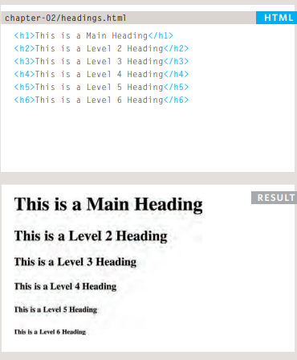
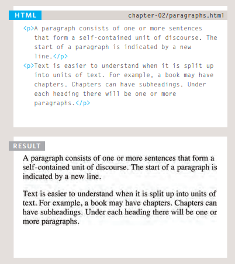
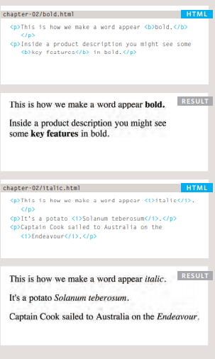
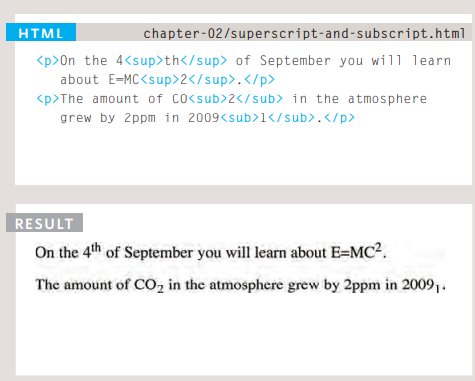
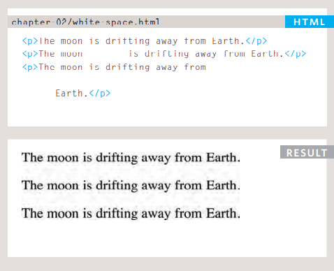
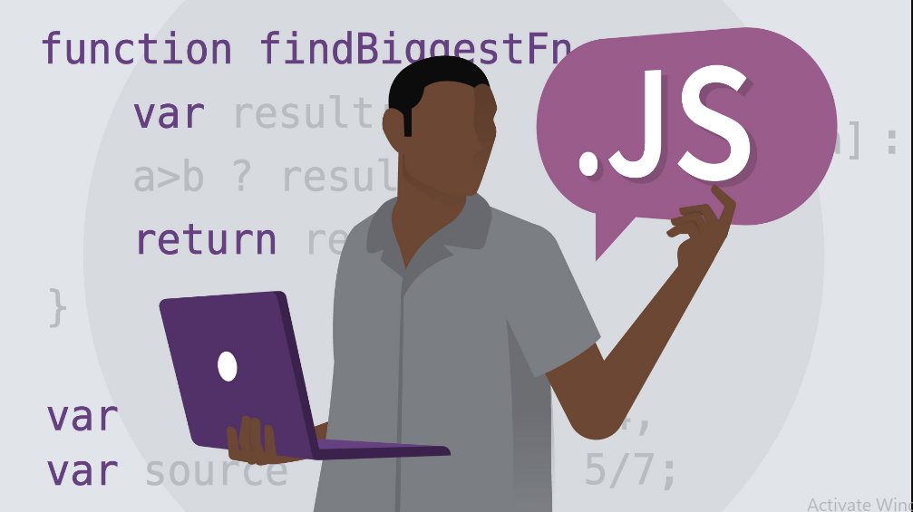

# Basics of HTML, CSS & JS

# Html Text

*  HTML elements are used to describe the structure of 
the page (e.g. headings, subheadings, paragraphs).
* They also provide semantic information (e.g. where emphasis should be placed, the definition of any acronyms used, when given text is a quotation).

**how to add markup to the text that appears on your pages: **

 1.  Structural markup: the elements that you can use to 
describe both headings and paragraphs

 2.  Semantic markup: which provides extra information; such as where emphasis is placed in a sentence, that something you have written is a quotation (and who said it), the meaning of acronyms, and so on

## Headings 

## paragraphs
To create a paragraph, surround the words that make up the 
paragraph with an opening 
 tag and closing 
 tag.

## Bold & Italic
 ** <b> :**
By enclosing words in the tags <b> and </b> we can make 
characters appear bold.The <b> element also represents 
a section of text that would be presented in a visually different way (for example key words in a paragraph) although the use of the <b> element does not imply any additional meaning

** <i> :**
By enclosing words in the tags <i> and </i> we can make 
characters appear italic.The <i> element also represents 
a section of text that would be said in a different way from surrounding content — such as technical terms, names of ships, foreign words, thoughts, or other terms that would usually be italicized

## Superscript & SubscripT
### : 
The  element is used to contain characters that 
should be superscript such as the suffixes of dates or 
mathematical concepts like raising a number to a power such 
as 2^2.

### : 
The  element is used to contain characters that should 
be subscript. It is commonly used with foot notes or chemical formulas such as H2O

## White Space

## Line Breaks & Horizontal Rules
###   
As you have already seen, the browser will automatically show each new paragraph or heading on a new line. But if you wanted to add a line break inside the middle of a paragraph you can use the line break tag  br /.

### 

To create a break between themes — such as a change of 
topic in a book or a new scene in a play — you can add a 
horizontal rule between sections using the hr / tag.

## OTHERS TEXT TAGS :
* Changes to CONTENT **ins , del , s**
* Author Details ** address**
* Citations & Definitions  **cite , dfn**
* Abbreviations & Acronyms  **abbr**
* Quotations **blockquote , q**
* Strong & Emphasis **strong ,em** 

# Introducing CSS
**CSS Associates Style rules with HTML elements**

* CSS treats each HTML element as if it appears inside 
its own box and uses rules to indicate how that element should look.
*  Rules are made up of selectors (that specify the 
elements the rule applies to) and declarations (that 
indicate what these elements should look like).

*  Different types of selectors allow you to target your 
rules at different elements.

*  Declarations are made up of two parts: the properties 
of the element that you want to change, and the values 
of those properties. For example, the font-family property sets the choice of font, and the value arial specifies Arial as the preferred typeface.

* CSS rules usually appear in a separate document, 
although they may appear within an HTML page

# Basic javascript instructures

* A script is made up of a series of statements. Each
  statement is like a step in a recipe.
* Scripts contain very precise instructions. For example,
  you might specify that a value must be remembered
before creating a calculation using that value.
* Variables are used to temporarily store pieces of
information used in the script.
* Arrays are special types of variables that store more
than one piece of related information.
* JavaScript distinguishes between numbers (0-9),strings (text), and Boolean values (true or false).
* Expressions evaluate into a single value.
* Expressions rely on operators to calculate a value

## Decisions and loops
* Conditional statements allow your code to make
decisions about what to do next.
* Comparison operators (===, ! ==, ==, ! =, <, >, <=, =>)
are used to compare two operands.

* Logical operators allow you to combine more than one
set of comparison operators.

* if ... else statements allow you to run one set of code
if a condition is true, and another if it is false.

* switch statements allow you to compare a value
against possible outcomes (and also provides a default
option if none match).  

