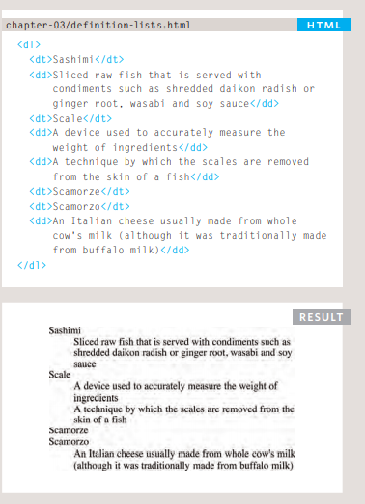

# HTML Lists, Control Flow with JS, and the CSS Box Model

# HTML Lists

### There are three types of HTML lists: 
* ordered
* unordered
* definition

### 1. ordered lists 

**Ordered lists use numbers.**
* < ol> :
The ordered list is created with the < ol> element.
* < li> :
Each item in the list is placed between an opening < li> tag and a closing < /li> tag. (The li stands for list item.)

### 2. unordered lists 
**Unordered lists use bullets.**
* < ul> :
The unordered list is created with the < ul> element.
* < li> :
Each item in the list is placed between an opening < li> tag and a closing < /li> tag. (The li stands for list item.)

### 3. Definition lists 
**Definition lists are used to define terminology.**

* < dl> :
The definition list is created with the < dl> element and usually consists of a series of terms and 
their definitions. Inside the < dl> element you will usually see pairs of < dt> and < dd> elements.

* < dt> :
This is used to contain the term being defined (the definition term).

* < dd> :
This is used to contain the definition. Sometimes you might see a list where there are two terms used 
for the same definition or two different definitions for the same term .

## Lists can be nested inside one another

 

# HTML boxes 
* CSS treats each HTML element as if it has its own box. 
* You can use CSS to control the dimensions of a box.
* You can also control the borders, margin and padding for each box with CSS.
* It is possible to hide elements using the display and visibility properties.
* Block-level boxes can be made into inline boxes, and inline boxes made into block-level boxes.
* Legibility can be improved by controlling the width of boxes containing text and the leading.
* CSS3 has introduced the ability to create image 
  borders and rounded borders.

  

# ARRAYS 
**JavaScript arrays are used to store multiple values in a single variable.**
 **var cars = ["Saab", "Volvo", "BMW"];**

 ### An array can hold many values under a single name, and you can access the values by referring to an index number.

## Creating an Array
***Using an array literal is the easiest way to create a JavaScript Array.***
**Syntax:**
**var array_name = [item1, item2, ...];**  
 
## VALUES IN ARRAYS 
***Values in an array are accessed as if they are in a numbered list. It is important to know that the 
numbering of this list starts at zero (not one).***
**var name = cars[0];**

# SWITCH STATEMENTS
### The switch statement is used to perform different actions based on different conditions.

**This is how it works:**

* The switch expression is evaluated once.
* The value of the expression is compared with the values of each case.
  * If there is a match, the associated block of code is executed.
  * If there is no match, the default code block is executed.

# JavaScript For Loop
**Loops can execute a block of code a number of times.**

## The for loop has the following syntax:

* Statement 1 is executed (one time) before the execution of the code block.

* Statement 2 defines the condition for executing the code block.

* Statement 3 is executed (every time) after the code block has been executed.

# JavaScript While Loop

**The while loop loops through a block of code as long as a specified condition is true.**
 ## Syntax :
### while (condition) {
  ### // code block to be executed
### }

 

# The Do/While Loop
**The do/while loop is a variant of the while loop. This loop will execute the code block once, before checking if the condition is true, then it will repeat the loop as long as the condition is true.**

## Syntax
### do {
  ### // code block to be executed
### }
### while (condition);

