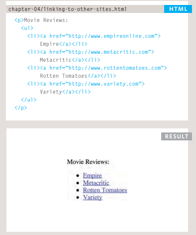
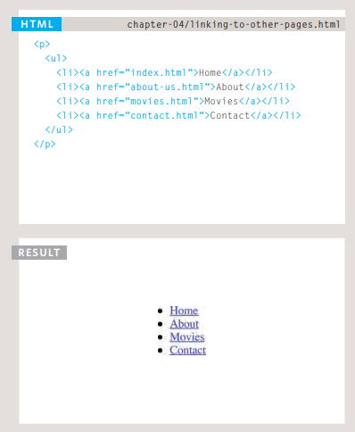

# HTML Links, JS Functions, and Intro to CSS Layout
# HTML Links :
## Links are found in nearly all web pages. Links allow users to click their way from page to page.
## HTML Links - Hyperlinks
**HTML links are hyperlinks.**
**You can click on a link and jump to another document.**
**When you move the mouse over a link, the mouse arrow will turn into a little hand.**

## HTML Links - Syntax
**The HTML < a> tag defines a hyperlink. It has the following syntax:**
## < a href="url">link text< /a>

***The most important attribute of the < a> element is the href attribute, which indicates the link's destination.***

***The link text is the part that will be visible to the reader.***

***Clicking on the link text, will send the reader to the specified URL address.***

## Linking to Other Sites :
Links are created using the < a> element which has an attribute href. The value of the href attribute is the page that 
you want people to go to when they click on the link. Users can click on anything that appears between the opening 
< a> tag and the closing < /a>tag and will be taken to the page specified in the href attribute.When you link to a different website, the value of the hrefattribute will be the full web address for the site, which is known as an absolute URL.
Browsers show links in blue with an underline by default.

< a> When you are linking to other pages within the same site, you do not need to specify the domain name in the URL. You can use a shorthand known as a 
relative URL.
If all the pages of the site are in the same folder, then the value of the href attribute is just the name of the file.
If you have different pages of a site in different folders, then you can use a slightly more complex 
syntax to indicate where the page is in relation to the current page. 

* # You can create links to open email programs with an email address in the "to" field .
* # You can use the id attribute to target elements within a page that can be linked to .

# HTML Layout :
**Websites often display content in multiple columns (like a magazine or a newspaper).**
* < div> elements are often used as containing elements to group together sections of a page.
* Browsers display pages in normal flow unless you specify relative, absolute, or fixed positioning.
 The float property moves content to the left or right of the page and can be used to create multi-column 
 layouts. (Floated items require a defined width.)
* Pages can be fixed width or liquid (stretchy) layouts.
* Designers keep pages within 960-1000 pixels wide, and indicate what the site is about within the top 600 
pixels (to demonstrate its relevance without scrolling).
* Grids help create professional and flexible designs.
* CSS Frameworks provide rules for common tasks.
* You can include multiple CSS files in one page
## HTML Layout Elements
**HTML has several semantic elements that define the different parts of a web page:**
* < header> - Defines a header for a document or a section
* < nav> - Defines a set of navigation links
* < section> - Defines a section in a document
* < article> - Defines an independent, self-contained content
* < aside> - Defines content aside from the content (like a sidebar)
* < footer> - Defines a footer for a document or a section
* < details> - Defines additional details that the user can open and close on demand
* < summary> - Defines a heading for the < details> element

## HTML Layout Techniques
**There are four different techniques to create multicolumn layouts. Each technique has its pros and cons:**

* CSS framework
* CSS float property
* CSS flexbox
* CSS grid

## CSS Frameworks
If you want to create your layout fast, you can use a CSS framework, like W3.CSS or Bootstrap.

## CSS Float Layout
It is common to do entire web layouts using the CSS float property. Float is easy to learn - you just need to remember how the float and clear properties work. Disadvantages: Floating elements are tied to the document flow, which may harm the flexibility

## CSS Flexbox Layout
Use of flexbox ensures that elements behave predictably when the page layout must accommodate different screen sizes and different display devices.

## CSS Grid Layout

The CSS Grid Layout Module offers a grid-based layout system, with rows and columns, making it easier to design web pages without having to use floats and positioning.

# JS Functions, Methods, and Objects :

**A JavaScript function is a block of code designed to perform a particular task.**

**A JavaScript function is executed when "something" invokes it (calls it).**

## JavaScript Function Syntax
### A JavaScript function is defined with the function keyword, followed by a name, followed by parentheses ().

### Function names can contain letters, digits, underscores, and dollar signs (same rules as variables).

### The parentheses may include parameter names separated by commas:
### (parameter1, parameter2, ...)

### The code to be executed, by the function, is placed inside curly brackets: {}

## Function Invocation
### The code inside the function will execute when "something" invokes (calls) the function:

### When an event occurs (when a user clicks a button)
### When it is invoked (called) from JavaScript code
### Automatically (self invoked)

## Function Return
### When JavaScript reaches a return statement, the function will stop executing.

### If the function was invoked from a statement, JavaScript will "return" to execute the code after the invoking statement.

### Functions often compute a return value. The return value is "returned" back to the "caller"

# pair programming

## What is meant by pair programming?
***Definition: Pair programming is an agile software development practice in which two programmers team up at one*** ***workstation to maximize efficiency. With pair programming, one of the two programmers (the driver) writes the code while the other watches and reviews (the observer)***

## What are two programmers in pair programming called?

**Pair programming is a practice in agile software development where two programmers share a workstation. This** **includes a single computer. One programmer (called the driver) writes the code while the other (the observer) watches, reviews, and provides guidance. The two programmers switch roles frequently.**

## What are the benefits of pair programming?
## Pair Programming Advantages :
* ## Two heads are better than one. If the driver encounters a hitch with the code, there will be two of them who'll solve the problem.
* ## More efficient. ...
* ## Fewer coding mistakes. ...
* ## An effective way to share knowledge. ...
* ## Develops your staff's interpersonal skills

**visit this link to know more about pair programming :**
[pair programming](https://en.wikipedia.org/wiki/Pair_programming)

