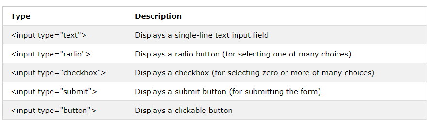
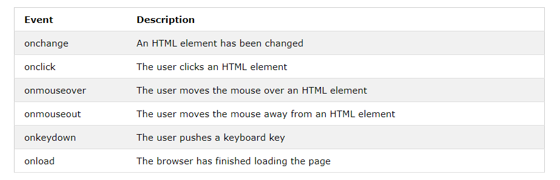

 # **Forms and JS Events :

 # **HTML Forms :

## An HTML form is used to collect user input. The user input is most often sent to a server for processing.

* # **The < form> Element**

## The HTML < form> element is used to create an HTML form for user input:

**< form>**
**.**
**form elements**
**.**
**< /form>**

## The < form> element is a container for different types of input elements, such as: text fields, checkboxes, radio buttons, submit buttons, etc.

* # **The < input> Element**
## The HTML < input> element is the most used form element.

## An < input> element can be displayed in many ways, depending on the type attribute.

* # **Text Fields**
## The <input type="text"> defines a single-line input field for text input.

* # **The < label> Element**

## The < label> tag defines a label for many form elements.

## The < label> element is useful for screen-reader users, because the screen-reader will read out loud the label when the user focus on the input element.

## The < label> element also help users who have difficulty clicking on very small regions (such as radio buttons or checkboxes) - because when the user clicks the text within the < label> element, it toggles the radio button/checkbox.

## The for attribute of the < label> tag should be equal to the id attribute of the < input> element to bind them together.

* # **Radio Buttons**
## The < input type="radio"> defines a radio button.

## Radio buttons let a user select ONE of a limited number of choices.

* # **Checkboxes**
## The < input type="checkbox"> defines a checkbox.

## Checkboxes let a user select ZERO or MORE options of a limited number of choices.

* # **The Submit Button**
## The < input type="submit"> defines a button for submitting the form data to a form-handler.

## The form-handler is typically a file on the server with a script for processing input data.

## The form-handler is specified in the form's action attribute.

* # **The Name Attribute for < input>**
## Notice that each input field must have a name attribute to be submitted.

## If the name attribute is omitted, the value of the input field will not be sent at all.

# **LISTS, TABLES AND FORMS**

* List markers can be given different appearances using the list-style-type and list-style image properties.

* Table cells can have different borders and spacing in different browsers, but there are properties you can 
use to control them and make them more consistent. 

* Forms are easier to use if the form controls are vertically aligned using CSS.

* Forms benefit from styles that make them feel more interactive

# **Events**

## HTML events are "things" that happen to HTML elements.

## When JavaScript is used in HTML pages, JavaScript can "react" on these events.

## **HTML Events**

## An HTML event can be something the browser does, or something a user does.

## Here are some examples of HTML events:

* An HTML web page has finished loading
* An HTML input field was changed
* An HTML button was clicked

## Often, when events happen, you may want to do something.

## JavaScript lets you execute code when events are detected.

## HTML allows event handler attributes, with JavaScript code, to be added to HTML elements.

## With single quotes:

## **< element event='some JavaScript'>**
## **With double quotes:**

## **< element event="some JavaScript">**

## Common HTML Events
**Here is a list of some common HTML events:**

# **What can JavaScript Do?**

## Event handlers can be used to handle and verify user input, user actions, and browser actions:

1. Things that should be done every time a page loads
2. Things that should be done when the page is closed
3. Action that should be performed when a user clicks a button
4. Content that should be verified when a user inputs data
And more ...

## Many different methods can be used to let JavaScript work with events:

* HTML event attributes can execute JavaScript code directly
* HTML event attributes can call JavaScript functions
* You can assign your own event handler functions to HTML elements
* You can prevent events from being sent or being handled
And more ...

