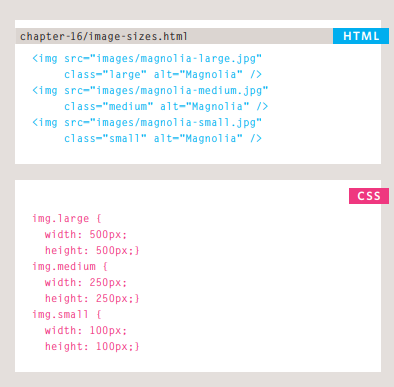
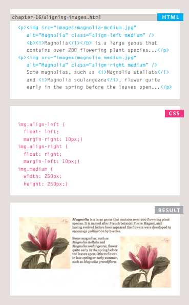
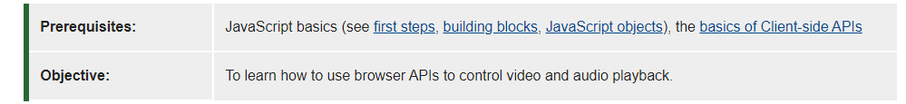
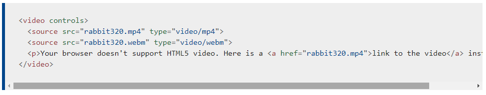
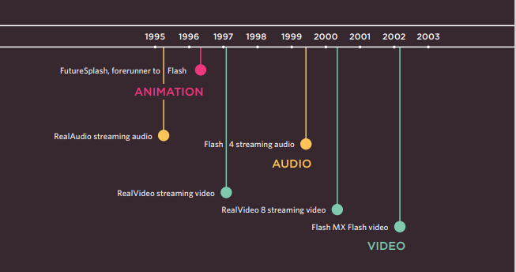
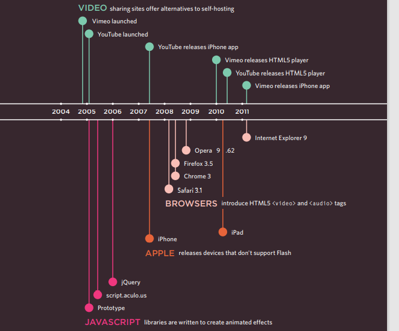

#  **Audio, Video, Images**

# **Images :**

Images can improve the design and the appearance of a web page.

## **HTML Images Syntax**
The HTML < img> tag is used to embed an image in a web page.

Images are not technically inserted into a web page; images are linked to web pages. The  tag creates a holding space for the referenced image.

The < img> tag is empty, it contains attributes only, and does not have a closing tag.

The < img> tag has two required attributes:

src - Specifies the path to the image
alt - Specifies an alternate text for the image

## **Controlling sizes of images in CSS:**

### You can specify the dimensions of images using CSS. This is very helpful when you use the same sized images on several pages of your site.

### You can control the size of an image using the width and height properties in CSS, just like you can for any other box

## **Aligning images using CSS:**

### Images can be aligned both horizontally and vertically using CSS

### Rather than using the element's align attribute, web page authors are increasingly using the float property to align images. There are two ways that this is commonly achieved:

### 1. The float property is added to the class that was created to represent the size of the image 

### 2. New classes are created with names such as align-left or align-right to align the images to the left or right of the page. These class names are used in addition to classes that indicate the size of the image

## **HTML Background Images :**

### To add a background image on an HTML element, use the HTML style attribute and the CSS background-image property .

**background-image: url('img_girl.jpg')>**

## **Background Image on a Page**
### If you want the entire page to have a background image, you must specify the background image on the < body> element

**body {**
  **background-image: url('img_girl.jpg');**
**}**

* ### You can use a background image behind the box created by any element on a page. 
* ### Background images can appear just once or be repeated across the background of the box.
* ### You can create image rollover effects by moving the background position of an image.
* ### To reduce the number of images your browser has to load, you can create image sprites.

# **Practical information**
* ## Search engine optimization helps visitors find your sites when using search engines.
* ## Analytics tools such as Google Analytics allow you to see how many people visit your site, how they find it, and what they do when they get there.
* ## To put your site on the web, you will need to obtain a domain name and web hosting.
* ## FTP programs allow you to transfer files from your local computer to your web server.
* ## Many companies provide platforms for blogging, email newsletters, e-commerce and other popular website tools (to save you writing them from scratch)

# **Audio and Video elements**

## HTML5 comes with elements for embedding rich media in documents — < video> and < audio> — which in turn come with their own APIs for controlling playback, seeking, etc. This article shows you how to do common tasks such as creating custom playback controls.

## The < video> and < audio> elements allow us to embed video and audio into web pages. As we showed in Video and audio content, a typical implementation looks like this:

## I think we've taught you enough in this article. The HTMLMediaElement API makes a wealth of functionality available for creating simple video and audio players, and that's only the tip of the iceberg. See the "See also" section below for links to more complex and interesting functionality.

## Here are some suggestions for ways you could enhance the existing example we've built up:

## 1. The time display currently breaks if the video is an hour long or more (well, it won't display hours; just minutes and seconds). Can you figure out how to change the example to make it display hours?

## 2. Because < audio> elements have the same HTMLMediaElement functionality available to them, you could easily get this player to work for an < audio> element too. Try doing so.

## 3. Can you work out a way to turn the timer inner < div> element into a true seek bar/scrobbler — i.e., when you click somewhere on the bar, it jumps to that relative position in the video playback? As a hint, you can find out the X and Y values of the element's left/right and top/bottom sides via the getBoundingClientRect() method, and you can find the coordinates of a mouse click via the event object of the click event, called on the Document object. For example:

# **Flash, VidEo & Audio**

## Web technologies change quickly. Here you can see some of the changes in how animation, video, and audio are created on the web.

### Sources:
* [the Duckett HTML book](https://app.slack.com/client/TNGRRLUMA/C0204N1MTQQ/thread/C0204N1MTQQ-1619354471.091300)
* [Article on audio and video elements](https://developer.mozilla.org/en-US/docs/Learn/JavaScript/Client-side_web_APIs/Video_and_audio_APIs)

