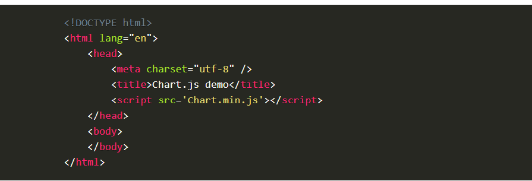
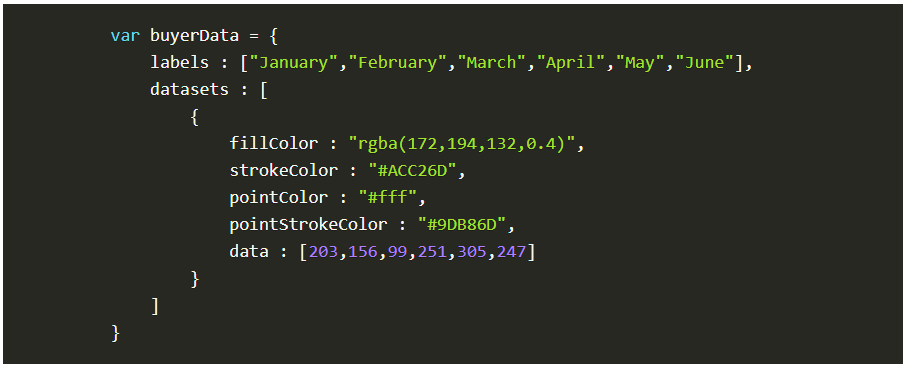
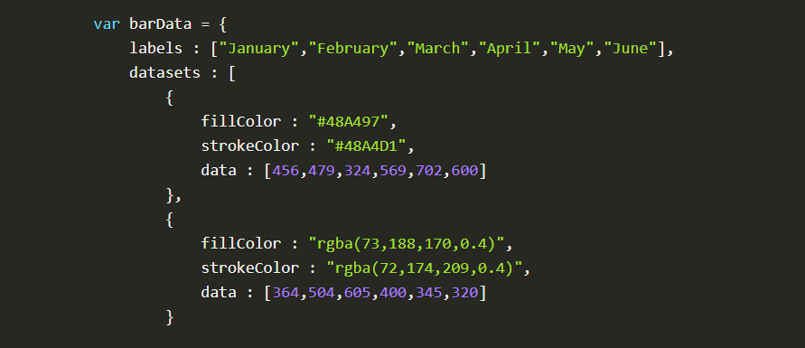
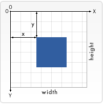
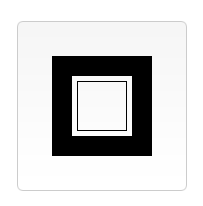
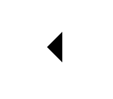
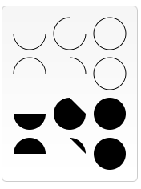
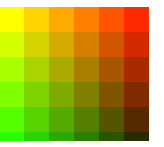
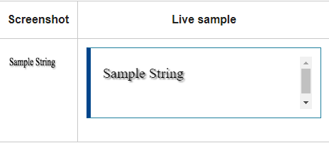
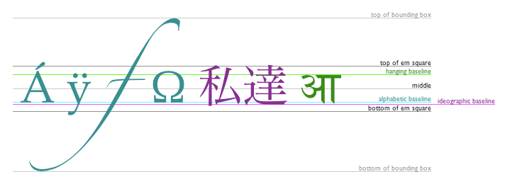

# **Chart.js, Canvas**

# **EASILY CREATE STUNNING ANIMATED CHARTS WITH CHART.JS**

## Charts are far better for displaying data visually than tables and have the added benefit that no one is ever going to press-gang them into use as a layout tool. They’re easier to look at and convey data quickly, but they’re not always easy to create.

## **HOW** to get started with charts is with Chart.js by following the bellow  :
## 1. Setting up
### The first thing we need to do is download Chart.js. Copy the Chart.min.js out of the unzipped folder and into the directory you’ll be working in. Then create a new html page and import the script:

## 2. Drawing a line chart
### To draw a line chart, the first thing we need to do is create a canvas element in our HTML in which Chart.js can draw our chart. So add this to the body of our HTML page:

**< canvas id="buyers" width="600" height="400">< /canvas >**

## 3. Next, we need to write a script that will retrieve the context of the canvas, so add this to the foot of your body element:

**< s cript>**
   **var buyers = document.getElementById('buyers').getContext('2d');**
    **new Chart(buyers).Line(buyerData);**
**< /script>**

## 4. Inside the same script tags we need to create our data, in this instance it’s an object that contains labels for the base of our chart and datasets to describe the values on the chart. Add this immediately above the line that begins ‘var buyers=’:

## 5. Drawing a pie chart
### Our line chart is complete, so let’s move on to our pie chart. First, we need the canvas element:

**< canvas id="countries" width="600" height="400">< /canvas>**
**Next, we need to get the context and to instantiate the chart:**

**var countries= document.getElementById("countries").getContext("2d");**
**new Chart(countries).Pie(pieData, pieOptions);**

## 6. Drawing a bar chart
### Finally, let’s add  a bar chart to our page. Happily the syntax for the bar chart is very similar to the line chart we’ve already added. First, we add the canvas element:

**< canvas id="income" width="600" height="400">< /canvas>**
### Next, we retrieve the element and create the graph:

**var income = document.getElementById("income").getContext("2d");**
**new Chart(income).Bar(barData);**

## 7. And finally, we add in the bar chart’s data:

# Canvas API
## **basic usage :** 
## The Canvas API provides a means for drawing graphics via JavaScript and the HTML < canvas> element. Among other things, it can be used for animation, game graphics, data visualization, photo manipulation, and real-time video processing.

## The Canvas API largely focuses on 2D graphics. The WebGL API, which also uses the < canvas> element, draws hardware-accelerated 2D and 3D graphics.

## **Drawing shapes with canvas like :**

- **The grid**

- **Drawing rectangles**

- **Drawing paths**

- **Drawing a triangle**

- **Arcs**

- **Cubic Bezier curves**

## **Applying styles and colors**
### **Colors**
### Up until now we have only seen methods of the drawing context. If we want to apply colors to a shape, there are two important properties we can use: fillStyle and strokeStyle.

### **Shadows**
Using shadows involves just four properties:

shadowOffsetX = float
Indicates the horizontal distance the shadow should extend from the object. This value isn't affected by the transformation matrix. The default is 0.
shadowOffsetY = float
Indicates the vertical distance the shadow should extend from the object. This value isn't affected by the transformation matrix. The default is 0.
shadowBlur = float
Indicates the size of the blurring effect; this value doesn't correspond to a number of pixels and is not affected by the current transformation matrix. The default value is 0.
shadowColor = color
A standard CSS color value indicating the color of the shadow effect; by default, it is fully-transparent black.
The properties shadowOffsetX and shadowOffsetY indicate how far the shadow should extend from the object in the X and Y directions; these values aren't affected by the current transformation matrix. Use negative values to cause the shadow to extend up or to the left, and positive values to cause the shadow to extend down or to the right. These are both 0 by default.

The shadowBlur property indicates the size of the blurring effect; this value doesn't correspond to a number of pixels and is not affected by the current transformation matrix. The default value is 0.

The shadowColor property is a standard CSS color value indicating the color of the shadow effect; by default, it is fully-transparent black.

## **Drawing text**
The canvas rendering context provides two methods to render text:

1. fillText(text, x, y [, maxWidth])
**Fills a given text at the given (x,y) position. Optionally with a maximum width to draw.**

2. strokeText(text, x, y [, maxWidth])
**Strokes a given text at the given (x,y) position. Optionally with a maximum width to draw.**

# **QUIZE :** 

## **Let's test your knowledge !**

**Q1: what is the methods to render text using canvas ??**

**Q2: shadows involves  four properties mention it ?**

**Q3: what is the basic usage for canvas API?**

### Sources:
* [Basic usage](https://developer.mozilla.org/en-US/docs/Web/API/Canvas_API)
* [Drawing text](https://developer.mozilla.org/en-US/docs/Web/API/Canvas_API/Tutorial/Drawing_text)

