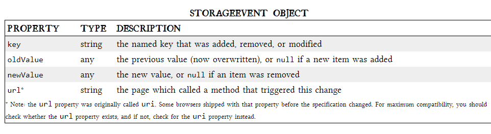
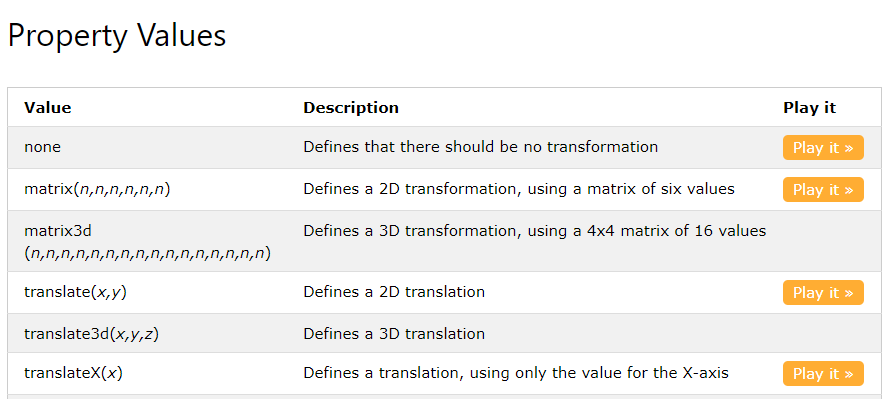
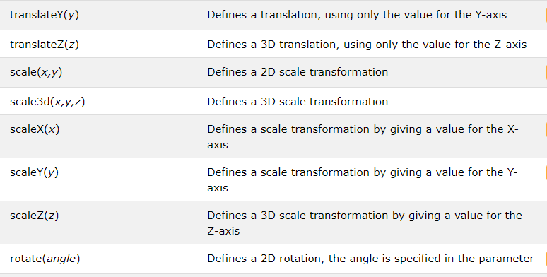
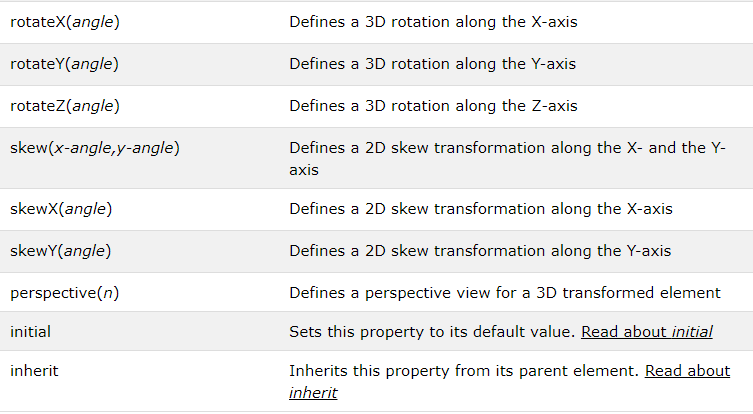
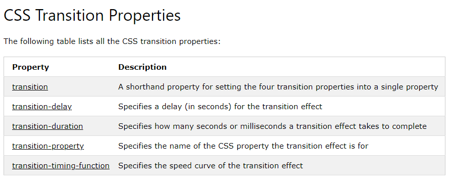
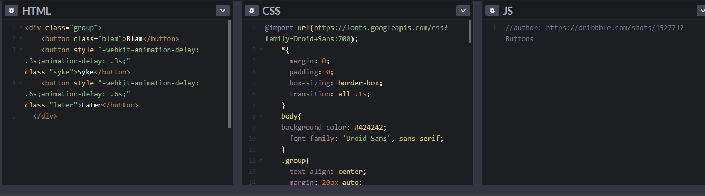

# **What Google Learned From Its Quest to Build the Perfect Team**

Like most 25-year-olds, Julia Rozovsky wasn’t sure what she wanted to do with her life. She had worked at a consulting firm, but it wasn’t a good match. Then she became a researcher for two professors at Harvard, which was interesting but lonely. Maybe a big corporation would be a better fit. Or perhaps a fast-growing start-up. All she knew for certain was that she wanted to find a job that was more social. ‘‘I wanted to be part of a community, part of something people were building together,’’ she told me. She thought about various opportunities — Internet companies, a Ph.D. program — but nothing seemed exactly right. So in 2009, she chose the path that allowed her to put off making a decision: She applied to business schools and was accepted by the Yale School of Management.

SIGN UP FOR THE GREAT READ: Every weekday, we recommend one piece of exceptional writing from The Times — a narrative or essay that takes you someplace you might not expect to go.
Sign Up
When Rozovsky arrived on campus, she was assigned to a study group carefully engineered by the school to foster tight bonds. Study groups have become a rite of passage at M.B.A. programs, a way for students to practice working in teams and a reflection of the increasing demand for employees who can adroitly navigate group dynamics. A worker today might start the morning by collaborating with a team of engineers, then send emails to colleagues marketing a new brand, then jump on a conference call planning an entirely different product line, while also juggling team meetings with accounting and the party-planning committee. To prepare students for that complex world, business schools around the country have revised their curriculums to emphasize team-focused learning.

Every day, between classes or after dinner, Rozovsky and her four teammates gathered to discuss homework assignments, compare spreadsheets and strategize for exams. Everyone was smart and curious, and they had a lot in common: They had gone to similar colleges and had worked at analogous firms. These shared experiences, Rozovsky hoped, would make it easy for them to work well together. But it didn’t turn out that way. ‘‘There are lots of people who say some of their best business-school friends come from their study groups,’’ Rozovsky told me. ‘‘It wasn’t like that for me.’’

Instead, Rozovsky’s study group was a source of stress. ‘‘I always felt like I had to prove myself,’’ she said. The team’s dynamics could put her on edge. When the group met, teammates sometimes jockeyed for the leadership position or criticized one another’s ideas. There were conflicts over who was in charge and who got to represent the group in class. ‘‘People would try to show authority by speaking louder or talking over each other,’’ Rozovsky told me. ‘‘I always felt like I had to be careful not to make mistakes around them.’’

# **CSS Transforms**
With CSS3 came new ways to position and alter elements. Now general layout techniques can be revisited with alternative ways to size, position, and change elements. All of these new techniques are made possible by the transform property.

The transform property comes in two different settings, two-dimensional and three-dimensional. Each of these come with their own individual properties and values.

Within this lesson we’ll take a look at both two-dimensional and three-dimensional transforms. Generally speaking, browser support for the transform property isn’t great, but it is getting better every day. For the best support vendor prefixes are encouraged, however you may need to download the nightly version of Chrome to see all of these transforms in action.

# Definition and Usage
## **The transform property applies a 2D or 3D transformation to an element. This property allows you to rotate, scale, move, skew, etc., elements.**

The transform property comes in two different settings, two-dimensional and three-dimensional. Each of these come with their own individual properties and values.

# **CSS Transitions**

## CSS Transitions
CSS transitions allows you to change property values smoothly, over a given duration.

## How to Use CSS Transitions?

To create a transition effect, you must specify two things:

the CSS property you want to add an effect to
the duration of the effect
Note: If the duration part is not specified, the transition will have no effect, because the default value is 0.

## Specify the Speed Curve of the Transition

The transition-timing-function property specifies the speed curve of the transition effect.

**The transition-timing-function property can have the following values:**

* ease - specifies a transition effect with a slow start, then fast, then end slowly (this is default)
* linear - specifies a transition effect with the same speed from start to end
* ease-in - specifies a transition effect with a slow start
* ease-out - specifies a transition effect with a slow end
* ease-in-out - specifies a transition effect with a slow start and end
* cubic-bezier(n,n,n,n) - lets you define your own values in a cubic-bezier function

# Delay the Transition Effect

The transition-delay property specifies a delay (in seconds) for the transition effect.

## 8 SIMPLE CSS3 TRANSITIONS prpparty 

1. Fade in
2. Change color
3. Grow & Shrink
4. Rotate elements
5. Square to circle
6. 3D shadow
7. Swing
8. Inset border

## Buttons animated

using **HTML , CSS**

## CSS3 Keyframes Animation
using **HTML , CSS**

