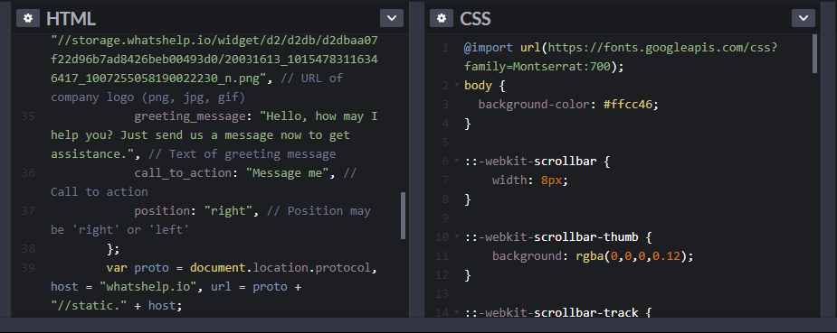

# **CSS Transforms**
With CSS3 came new ways to position and alter elements. Now general layout techniques can be revisited with alternative ways to size, position, and change elements. All of these new techniques are made possible by the transform property.

The transform property comes in two different settings, two-dimensional and three-dimensional. Each of these come with their own individual properties and values.

Within this lesson we’ll take a look at both two-dimensional and three-dimensional transforms. Generally speaking, browser support for the transform property isn’t great, but it is getting better every day. For the best support vendor prefixes are encouraged, however you may need to download the nightly version of Chrome to see all of these transforms in action.

# Definition and Usage
## **The transform property applies a 2D or 3D transformation to an element. This property allows you to rotate, scale, move, skew, etc., elements.**

The transform property comes in two different settings, two-dimensional and three-dimensional. Each of these come with their own individual properties and values.

# **CSS Transitions**

## CSS Transitions
CSS transitions allows you to change property values smoothly, over a given duration.

## How to Use CSS Transitions

To create a transition effect, you must specify two things:

the CSS property you want to add an effect to
the duration of the effect
Note: If the duration part is not specified, the transition will have no effect, because the default value is 0.

## Specify the Speed Curve of the Transition

The transition-timing-function property specifies the speed curve of the transition effect.

**The transition-timing-function property can have the following values:**

* ease - specifies a transition effect with a slow start, then fast, then end slowly (this is default)
* linear - specifies a transition effect with the same speed from start to end
* ease-in - specifies a transition effect with a slow start
* ease-out - specifies a transition effect with a slow end
* ease-in-out - specifies a transition effect with a slow start and end
* cubic-bezier(n,n,n,n) - lets you define your own values in a cubic-bezier function

# Delay the Transition Effect

The transition-delay property specifies a delay (in seconds) for the transition effect.

## 8 SIMPLE CSS3 TRANSITIONS prpparty 

1. Fade in
2. Change color
3. Grow & Shrink
4. Rotate elements
5. Square to circle
6. 3D shadow
7. Swing
8. Inset border

## Buttons animated

using **HTML , CSS**

## CSS3 Keyframes Animation
using **HTML , CSS**

# **QUIZE :** 

## **Let's test your knowledge !**

**Q1: How to Use CSS Transitions? ??**

**Q2: what is CSS Transforms?**

**Q3: CSS Transitions ?**

### Sources:
* [CSS Transforms](https://learn.shayhowe.com/advanced-html-css/css-transforms/)
* [CSS Transitions & Animations](https://learn.shayhowe.com/advanced-html-css/transitions-animations/)

