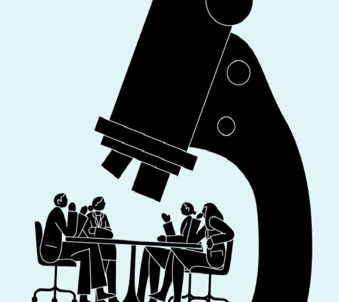
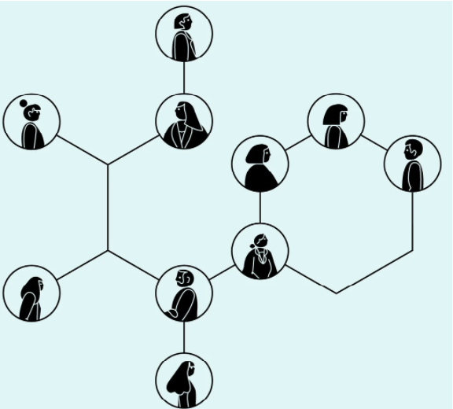

# **What Google Learned From Its Quest to Build the Perfect Team**

Like most 25-year-olds, Julia Rozovsky wasn’t sure what she wanted to do with her life. She had worked at a consulting firm, but it wasn’t a good match. Then she became a researcher for two professors at Harvard, which was interesting but lonely. Maybe a big corporation would be a better fit. Or perhaps a fast-growing start-up. All she knew for certain was that she wanted to find a job that was more social. ‘‘I wanted to be part of a community, part of something people were building together,’’ she told me. She thought about various opportunities — Internet companies, a Ph.D. program — but nothing seemed exactly right. So in 2009, she chose the path that allowed her to put off making a decision: She applied to business schools and was accepted by the Yale School of Management.

SIGN UP FOR THE GREAT READ: Every weekday, we recommend one piece of exceptional writing from The Times — a narrative or essay that takes you someplace you might not expect to go.
Sign Up
When Rozovsky arrived on campus, she was assigned to a study group carefully engineered by the school to foster tight bonds. Study groups have become a rite of passage at M.B.A. programs, a way for students to practice working in teams and a reflection of the increasing demand for employees who can adroitly navigate group dynamics. A worker today might start the morning by collaborating with a team of engineers, then send emails to colleagues marketing a new brand, then jump on a conference call planning an entirely different product line, while also juggling team meetings with accounting and the party-planning committee. To prepare students for that complex world, business schools around the country have revised their curriculums to emphasize team-focused learning.

Every day, between classes or after dinner, Rozovsky and her four teammates gathered to discuss homework assignments, compare spreadsheets and strategize for exams. Everyone was smart and curious, and they had a lot in common: They had gone to similar colleges and had worked at analogous firms. These shared experiences, Rozovsky hoped, would make it easy for them to work well together. But it didn’t turn out that way. ‘‘There are lots of people who say some of their best business-school friends come from their study groups,’’ Rozovsky told me. ‘‘It wasn’t like that for me.’’

Instead, Rozovsky’s study group was a source of stress. ‘‘I always felt like I had to prove myself,’’ she said. The team’s dynamics could put her on edge. When the group met, teammates sometimes jockeyed for the leadership position or criticized one another’s ideas. There were conflicts over who was in charge and who got to represent the group in class. ‘‘People would try to show authority by speaking louder or talking over each other,’’ Rozovsky told me. ‘‘I always felt like I had to be careful not to make mistakes around them.’’

## Our data-saturated age enables us to examine our work habits and office quirks with a scrutiny that our cubicle-bound forebears could only dream of. Today, on corporate campuses and within university laboratories, psychologists, sociologists and statisticians are devoting themselves to studying everything from team composition to email patterns in order to figure out how to make employees into faster, better and more productive versions of themselves. ‘‘We’re living through a golden age of understanding personal productivity,’’ says Marshall Van Alstyne, a professor at Boston University who studies how people share information. ‘‘All of a sudden, we can pick apart the small choices that all of us make, decisions most of us don’t even notice, and figure out why some people are so much more effective than everyone else.’’

## **THE WORK ISSUE: REIMAGINING THE OFFICE**

1. How to Build a Perfect Team
2. The War on Meetings
3. The Case for Blind Hiring
4. Failure to Lunch
5. The 'Good Jobs' Gamble
6. Rethinking the Work-Life Equation
7. The Rise of White-Collar Automation
8. The Post-Cubicle Office
9. The New Dream Jobs

# **Project Aristotle’s researchers** 

began by reviewing a half-century of academic studies looking at how teams worked. Were the best teams made up of people with similar interests? Or did it matter more whether everyone was motivated by the same kinds of rewards? Based on those studies, the researchers scrutinized the composition of groups inside Google: How often did teammates socialize outside the office? Did they have the same hobbies? Were their educational backgrounds similar? Was it better for all teammates to be outgoing or for all of them to be shy? They drew diagrams showing which teams had overlapping memberships and which groups had exceeded their departments’ goals. They studied how long teams stuck together and if gender balance seemed to have an impact on a team’s success.

No matter how researchers arranged the data, though, it was almost impossible to find patterns — or any evidence that the composition of a team made any difference. ‘‘We looked at 180 teams from all over the company,’’ Dubey said. ‘‘We had lots of data, but there was nothing showing that a mix of specific personality types or skills or backgrounds made any difference. The ‘who’ part of the equation didn’t seem to matter.’’

Some groups that were ranked among Google’s most effective teams, for instance, were composed of friends who socialized outside work. Others were made up of people who were basically strangers away from the conference room. Some groups sought strong managers. Others preferred a less hierarchical structure. Most confounding of all, two teams might have nearly identical makeups, with overlapping memberships, but radically different levels of effectiveness. ‘‘At Google, we’re good at finding patterns,’’ Dubey said. ‘‘There weren’t strong patterns here.’’

As they struggled to figure out what made a team successful, Rozovsky and her colleagues kept coming across research by psychologists and sociologists that focused on what are known as ‘‘group norms.’’ Norms are the traditions, behavioral standards and unwritten rules that govern how we function when we gather: One team may come to a consensus that avoiding disagreement is more valuable than debate; another team might develop a culture that encourages vigorous arguments and spurns groupthink. Norms can be unspoken or openly acknowledged, but their influence is often profound. Team members may behave in certain ways as individuals — they may chafe against authority or prefer working independently — but when they gather, the group’s norms typically override individual proclivities and encourage deference to the team.

Project Aristotle’s researchers began searching through the data they had collected, looking for norms. They looked for instances when team members described a particular behavior as an ‘‘unwritten rule’’ or when they explained certain things as part of the ‘‘team’s culture.’’ Some groups said that teammates interrupted one another constantly and that team leaders reinforced that behavior by interrupting others themselves. On other teams, leaders enforced conversational order, and when someone cut off a teammate, group members would politely ask everyone to wait his or her turn. Some teams celebrated birthdays and began each meeting with informal chitchat about weekend plans. Other groups got right to business and discouraged gossip. There were teams that contained outsize personalities who hewed to their group’s sedate norms, and others in which introverts came out of their shells as soon as meetings began.

## **In late 2014,** 
Rozovsky and her fellow Project Aristotle number-crunchers began sharing their findings with select groups of Google’s 51,000 employees. By then, they had been collecting surveys, conducting interviews and analyzing statistics for almost three years. They hadn’t yet figured out how to make psychological safety easy, but they hoped that publicizing their research within Google would prompt employees to come up with some ideas of their own.

After Rozovsky gave one presentation, a trim, athletic man named Matt Sakaguchi approached the Project Aristotle researchers. Sakaguchi had an unusual background for a Google employee. Twenty years earlier, he was a member of a SWAT team in Walnut Creek, Calif., but left to become an electronics salesman and eventually landed at Google as a midlevel manager, where he has overseen teams of engineers who respond when the company’s websites or servers go down.

Image

Credit...Illustration by James Graham
‘‘I might be the luckiest individual on earth,’’ Sakaguchi told me. ‘‘I’m not really an engineer. I didn’t study computers in college. Everyone who works for me is much smarter than I am.’’ But he is talented at managing technical workers, and as a result, Sakaguchi has thrived at Google. He and his wife, a teacher, have a home in San Francisco and a weekend house in the Sonoma Valley wine country. ‘‘Most days, I feel like I’ve won the lottery,’’ he said.

# **As long as everyone got a chance to talk, the team did well. But if only one person or a small group spoke all the time, the collective intelligence declined.**

